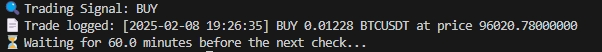
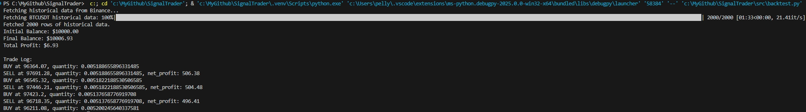

# SignalTrader

## Introduction / 介紹

**SignalTrader** is a Python-based automated trading bot designed for cryptocurrency trading using the **Binance API**. The bot leverages technical indicators such as **RSI** (Relative Strength Index) and **MACD** (Moving Average Convergence Divergence) to generate buy, sell, or hold signals. The project now also includes a **backtesting module** to simulate and validate trading strategies on historical data.

**SignalTrader** 是一個基於 Python 並使用 **Binance API** 的自動化加密貨幣交易機器人。透過 **RSI**（相對強弱指數）與 **MACD**（移動平均匯聚背離）等技術指標生成買入、賣出或持有信號。該專案現已新增 **回測模組**，可用於在歷史數據上模擬和驗證交易策略。

---

## Example Bot Execution / 機器人執行示例

- **Example 1: Real-Time Trading Signal and Order Logging / 即時交易信號與訂單記錄**  
  

- **Example 2: Backtesting Strategy Simulation / 回測策略模擬**  
  

---

## Features / 功能特色

1. **Automated Trading / 自動化交易**  
   Automatically places market orders based on trading signals.  
   根據交易信號自動執行市價單。  

2. **Technical Indicators / 技術指標**  
   Uses RSI and MACD for trend detection.  
   利用 RSI 和 MACD 檢測市場趨勢。  

3. **Risk Management / 風險管理**  
   Dynamically calculates the order quantity based on a specified percentage of available capital.  
   動態計算下單量，根據可用資金的指定比例進行交易。  

4. **Configurable Parameters / 參數配置**  
   Easily adjust RSI, MACD, and check intervals in the configuration file.  
   可輕鬆透過設定檔調整 RSI、MACD 和檢查頻率等參數。  

5. **Backtesting Module / 回測模組**  
   Simulate strategies on historical data and analyze performance.  
   在歷史數據上模擬交易策略並分析績效。  

---

## Installation / 安裝

1. **Clone the repository / 複製專案**  
   ```bash
   git clone https://github.com/yourusername/SignalTrader.git
   cd SignalTrader
   ```

2. **Install dependencies / 安裝相依套件**  
   ```bash
   pip install -r requirements.txt
   ```

3. **Set up environment variables / 設定環境變數**  
   Create a `.env` file in the root directory and add your **Binance API keys**:  
   建立 `.env` 檔案並新增你的 **Binance API 金鑰**：

   ```
   BINANCE_API_KEY=your_api_key
   BINANCE_API_SECRET=your_api_secret
   ```

---

## Configuration / 配置

Edit the `config.py` file to customize trading parameters.  
編輯 `config.py` 來自訂交易參數。

```python
# Trading pair settings
SYMBOL = "BTCUSDT"  # Trading pair

# Trading configuration
ORDER_PERCENTAGE = 0.1  # Use 10% of available capital per order
CHECK_INTERVAL = 3600  # Check the market every hour
INTERVAL = "1h"  # K-line (candlestick) interval set to 1 hour

# RSI and MACD configuration
RSI_WINDOWS = [3, 5, 10]  # RSI time periods, can be adjusted as needed
MACD_FAST = 3  # MACD fast moving average
MACD_SLOW = 8  # MACD slow moving average
MACD_SIGNAL = 2  # MACD signal line

# Backtesting configuration
LIMIT = 2000  # Number of data points to retrieve
BINANCE_FEE = 0.001  # Binance trading fee (0.1%)
```

---

## How to Run / 如何執行

1. **Run the trading bot / 執行交易機器人**  
   ```bash
   python main.py
   ```

2. **Run the backtesting module / 執行回測模組**  
   ```bash
   python backtest.py
   ```

---

## Trading Logic / 交易邏輯

- **Buy Signal (BUY) / 買入信號（BUY）**  
  Short-term RSI < 40 (oversold) / 短期 RSI < 40（輕微超賣）  
  MACD Line crosses above the Signal Line / MACD 主線上穿信號線  

- **Sell Signal (SELL) / 賣出信號（SELL）**  
  Short-term RSI > 60 (overbought) / 短期 RSI > 60（輕微超買）  
  MACD Line crosses below the Signal Line / MACD 主線下穿信號線  

- **Hold Signal (HOLD) / 持有信號（HOLD）**  
  No strong signal detected / 未偵測到強烈信號  

---

## Backtesting / 回測

1. **Edit the parameters in `config.py` to match your trading strategy / 在 `config.py` 中調整參數，配置你的交易策略**  
2. **Run the backtesting module / 執行回測模組**  
   ```bash
   python backtest.py
   ```
3. **Review the trade log and final balance printed to the console / 檢視交易日誌與最終資金餘額**  

---

## Example Trade Log / 交易日誌示例

```
[2025-02-08 14:35:22] BUY 0.002345 BTCUSDT at price 95992.91
[2025-02-08 15:35:33] SELL 0.002345 BTCUSDT at price 98551.03, net_profit: $512.81
```

---

## Disclaimer / 免責聲明

**Important Notice:** This project is for educational and demonstration purposes only. Cryptocurrency trading involves significant risks, and you can lose all your invested capital. The developer of this project is not responsible for any financial losses incurred while using this bot.  

**重要聲明：** 本專案僅用於教育和演示目的。加密貨幣交易具有高風險，您可能會損失全部投資資金。專案開發者不對使用該機器人產生的任何財務損失承擔責任。  

### Recommendations for Safe Trading / 安全交易建議

- **Test with Small Capital / 從小額資金開始**: Start with a small amount of money or use Binance's testnet to minimize risks.  
  使用小額資金進行測試，或使用 Binance 測試網來減少風險。  

- **Backtest Thoroughly / 充分回測策略**: Always backtest your strategy using historical data before applying it in real trading.  
  在進行實時交易前，務必使用歷史數據回測策略。  

- **Implement Stop-Loss / 設置止損機制**: Consider adding a stop-loss mechanism to automatically limit potential losses.  
  考慮加入止損機制，自動限制潛在的損失。  

- **Monitor Performance / 監控機器人性能**: Regularly monitor your bot's performance and adjust parameters as needed.  
  定期監控機器人的表現，根據需要調整參數。  

---

## License / 授權

This project is licensed under the MIT License. See the [LICENSE](LICENSE) file for details.  
此專案採用 MIT 授權，詳細內容請參閱 [LICENSE](LICENSE) 文件。
